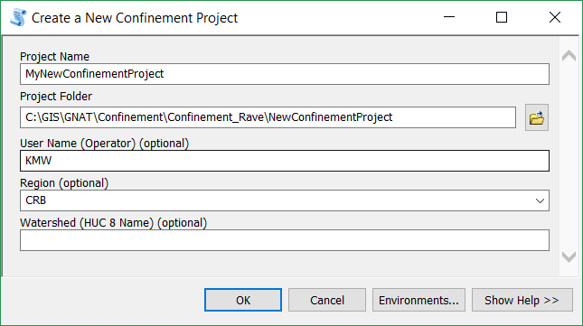

# Confinement Project

While the confinement tool can be used on any GIS data, a preferred workflow is to use a Confinement Project. A confinement project is simply a managed folder structure with an accompanying XML file. The confinement tools are structured to use this XML file to find data and keep a record of all outputs and analysis for a particular set of confinement data. 

A confinement project is also structured to work with the Riverscapes Analyst Toolbar and Data Warehouse. If data is to be included in this system, then it must be processed as a Confinement Project.

Confinement Projects must be set up at the start of processing. There are currently no tools to convert previous results into a confinement project.

# Using a Confinement Project
Version 2.1.01
## Create a New Confinement Project
1. Create an empty folder on your system that will store the confinement project. Input datasets will be copied to this location through the project workflow

2. Open ArcMap and navigate to Confinement Toolbox / Confinement Project Management / Create a New Confinement Project in ArcToolbox.
	1. Specify the **Name** of the New Project.
	2. Specify the **location of the Folder** you created in step 1 .
	3. Specify the **User** name creating the Project
	4. Specify the Region of the data for the project. ***This is limited to CRB (Columbia River Basin) for now.***
	5. Specify the Watershed (Huc) of the project.
	6. Click OK to generate the new project XML file.

Do not manually add data to the project folder. You will do this as a tool supported process in the next step. 

## Load Input Datasets to Project

1. In order to generate confinement within a project, you must first load the three input files to the project.
2. In ArcMap navigate to Confinement Toolbox / Confinement Project Management /  Load Input Datasets in ArcToolbox.
	1. Specify the Project.xml file created in step 1.
	2. Specify the following three inputs to the project:
		* Stream Network
		* Channel/Bankfull Buffer Polygon
		* Valley Bottom Poygon
	> These inputs may be of any GIS vector format (as recognized by ArcGIS), however when they are imported into the project, they will stored as Shapefiles (.shp). This should not have any affect on the data other than limiting the field names to 10 characters. 	
	2. Click OK to import the inputs into the project.
	

3. The Project.xml file will be updated to include these inputs, and they will be stored appropriately in the Project folder structure.

** At this point in the project, do not move any files within the project folder. Doing so could cause the project to become corrupt. **	

## Generate a Confinement Realization (Confining Margins)

With the inputs loaded into the project, the next step is to generate the Raw Confining State and Confining Margins from the inputs. Collectively this step is called a "Confinement Realization" within the project. You may have more than one Realizations stored in a Confinement Project.

For more information on what this tool is doing, refer to the documentation on the [Confining Margins Tool](ConfinementTool).

1. Make sure you have loaded at least one of each of the three inputs from step 2.
2. In ArcMap navigate to Confinement Toolbox / Confinement Tools /  Confining Margins Tool in ArcToolbox.
	1. Specify the **Project.XML** file.
	2. Specify the ** Name of the new Realization**. The tool will check if there is already a realization with the specified name already stored in the project.
	3. Specify the Three Inputs.
	** Please navigate within the project folder to find these inputs. *A future version of the tool will limit these inputs for you.***
	2. The outputs will be automatically created for you within the project.
	3. *Optional* Specify a temporary workspace.
	4. Click OK to run the tool.

## Calculating and Analyzing Confinement

An analysis is the 'second step' in confinement process. An analysis must be associated with one and only one "Realization." If a new realization is created within a project, new analyses must be generated for the new realization. ** A Project will store all realizations and analyses. At this point, there is no support for deleting a realization or analysis from a project.**

An Analysis tool will calculate Confinement  using one of the three tools in the Analysis toolset. Each are described below.

### Moving Window
This section describes how to generate a Moving Window Analysis within a Project. For more information on what a Moving Window Analysis is, see [Moving Window Tool](MovingWindowTool).

### Fixed Segments
***This tool will be supported in the next tool release.***

### Custom Segments
***This tool will be supported in the next tool release.***

# Components of a Confinement Project

- Project
	- Project MetaData
		- Operator
		- Region
		- Watershed
		- DateCreated
	- Inputs
		- **Definition** List of all Inputs used throughought the history of the Project, including
			- Stream Networks
			- Channel Polygons
			- Valley Bottoms
	- Realizations
		- **Definition** A realization is the first step in the Confinement Process, and consists of generating the Raw Confining State and Confining Margins for a set of inputs. 
		- Outputs
			- Raw Confining State
			- ConfiningMargins
		- Analyses
			- **Definition** An Analysis is the processing of the results of a realization. An anaysis is tied to the realization, and there can be any number of analyses of any type for any one realization.
			- Types:
				- Moving Window
				- Fixed Segments
				- Custom Segments