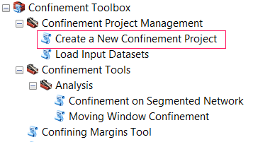

A [Confinement Riverscapes Project](About-Confinement-Projects) is used to manage the contents of a Confinement Calculation and Analysis. 

## Before You Start

Make sure you have the following datasets, cleaned and ready to go:

- ***Stream Line Network*** Clean and segment the stream network as desired. Since Confinement values will be calculated using the segmentation of the network you load into the project, you must do this ***prior*** to loading the project. We recommend using the [GNAT Toolset](https://github.com/SouthForkResearch/gnat/wiki) to perform these actions.

- ***Valley Bottom Polygon*** Make sure the valley bottom polygon is clean, and represents the confining margin boundary throughout the network. Ideally, this polygon should contain the entire stream network to produce the best results, but is not a requirement for the confinement tool to function.

- ***Active Channel Polygon*** (i.e. Bankfull Buffer) Make sure the channel polygon is sufficiently large/buffered to intersect the valley bottom polygon where confinement is believed to exist. It is suggested to exaggerate this buffer slightly to account for GIS/digitization uncertainty in the line network and valley bottom polygons.

You can always load new inputs to the confinement project, however, you cannot (currently) delete inputs once they are loaded to the project, and you should ***never*** edit or alter an input that has already been loaded to the project.

## Steps to Create a Confinement Project

1. Create an empty folder on your system that will store the confinement project. Input datasets will be copied to this location through the project workflow.

2. Open ArcMap and navigate to Confinement Toolbox / Confinement Project Management / Create a New Confinement Project in ArcToolbox.
  1. Specify the **Name** of the New Project.

  2. Specify the **location of the Folder** you created in step 1 .

  3. Specify the **User** name creating the Project

  4. Specify the Region of the data for the project. ***This is limited to CRB (Columbia River Basin) for now.***

  5. Specify the Watershed of the project. 

     > Note: Riverscapes users must use a watershed name accepted by the program).

  6. Click OK to generate the new project XML file.

You will now add data to the project in [Step 2](Load-Input-Datasets).
