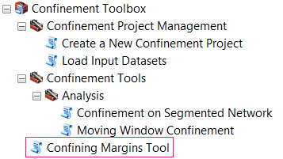

The Confining Margins tool generates both the Confining Margins (intersection of the edges of the valley bottom polygon and the active channel polygon) and transfers this information to the Stream Line Network using a near-function method. This information can then be used to calculate confinement values based on  segment lengths or moving windows along the line network. This tool can be used in either a Confinement Project or as a stand-alone tool. 

[TOC]

# Tool Usage

## Project Mode

With the inputs loaded into the project, the next step is to generate the Raw Confining State and Confining Margins from the inputs. Collectively this step is called a "Confinement Realization" within the project. You may have more than one Realization stored in a Confinement Project.

1. Make sure you have loaded at least one of each of the three inputs from step 2.

2. In ArcMap navigate to Confinement Toolbox / Confinement Tools /  Confining Margins Tool in ArcToolbox.

3. Specify the **project.rs.xml** file. The Confining Margins Tool window will enter "Project Mode".

4. Specify the **name of the new Realization**. Since projects must contain uniquely named realizations, the tool will check if there is already a realization with the specified name already stored in the project.

5. Specify the three input datasets.

    - Stream Network
    - Active Channel Polygon (i.e. "Bankfull Buffer")
    - Valley Bottom Polygon

    Note: You will need to navigate within the project folder to find these inputs. **Do not use input files from outside of the project!**

6. The outputs will be automatically created for you within the project.

7. *Optional* Specify a temporary workspace.

8. Click OK to run the tool.

Proceed to [Calculate Confinement by Segments](Calculating-Confinement) or [Moving Window Analysis](MovingWindowTool)

------

## Stand Alone (non-project) Mode

This tool allows you to generate Raw Confining State and Confining Margins from a set of valley bottom, channel polygon, and stream network. 

For more information on what this tool is doing, refer to the documentation on the [Confining Margins Tool](ConfinementTool).

1. Make sure you have prepared each of the three inputs.

2. In ArcMap navigate to Confinement Toolbox / Confinement Tools /  Confining Margins Tool in ArcToolbox.

3. Leave the project file parameter empty. 

4. Specify the three input datasets:
   - Stream Network
   - Active Channel Polygon (i.e. "Bankfull Buffer")
   - Valley Bottom Polygon

5. Specify the Name and Location of the output datasets:

   * Raw Confining Network
   * Confining Margins

6. *Optional* Specify a temporary workspace.

7. Click OK to run the tool.

   Proceed to [Calculate Confinement by Segments](Calculating-Confinement) or [Moving Window Analysis](MovingWindowTool)

------

# About 

## Methods 

## Outputs

### Raw Confining State

Output Polyline shapefile that will store the raw confining state of the Stream Network. This file will retain the original attributes, but will split the network as needed to include the following new attributes:

> Note: The side of the stream is relative, and does not necessarily refer to conventional definitions of river-right or river-left.

- `Con_LEFT ` and `CON_RIGHT` *Int*
  - 1 = section is confined on that side the stream.
  - 0 = section is not confined on that side of the stream. 
- `CON_TYPE` *String* 
  - "None" = Not confined on either side of the stream. Same as "Unconfined".
  - "Right" = Confined on right side of stream.
  - "Left" = Confined on left side of the stream. 
  - "Both" = Confined on both sides of the stream. Same as "Constricted"
- `IsConfined`: *Int*
  - 1 = section is considered confined (i.e. Confinement_Type = Right, left, or Both).
  - 0 = section is considered unconfined.
- `IsConstrict` *Int*
  - 1 = section is considered confined (i.e. Confinement_Type = Right, left, or Both).
  - 0 = section is considered unconfined.

### Confining Margins

Output polyline shapefile that represents the confining margins as the intersection of the input stream channel and valley bottom polygons. The significance of this dataset is geometric, and has no meaningful attributes. 