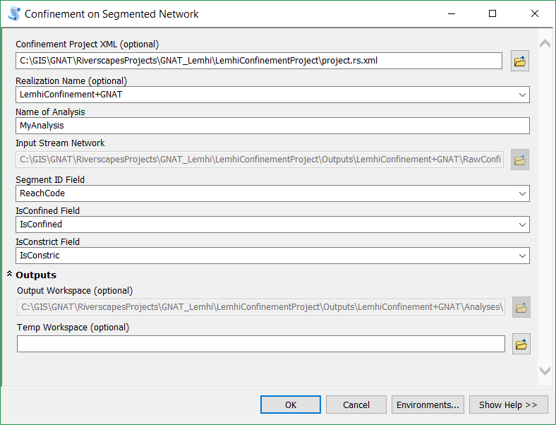

This tool Calculates Confinement along the Segments in the Stream Network.

[TOC]

# Tool Usage

## Project Mode

Confinement by Segments results are stored as a "confinement analysis" and are associated with one and only one "Realization." If a new realization is created within a project, new analyses must be generated for the new realization. 

> **A Project will store all realizations and analyses. At this point, there is no support for deleting a realization or analysis from a project.**

1. Make sure you have generated at least one Confinement Realization.
2. In ArcMap navigate to Confinement Toolbox / Confinement Tools / Analysis / Confinement on Segmented Network Tool in ArcToolbox.
   1. Specify the **Project.XML** file. The Tool window will enter "Project Mode".
   2. From the Dropdown, select the Realization you want to base your analysis on.
      1. The Tool will automatically use the correct Stream Network Input from the specified Realization.
   3. Provide a unique name for the Confinement Segments Analysis. The tool will check to make sure the name you provide does not already exist.
   4. Specify a **SegmentID** Field that contains the unique ID's of the Segmentation of the network that will be used to calculate confinement values on.
   5. The tool will attempt to find the correct confinement and Constriction fields.
   6. In "Project Mode", the output workspace is managed for you, 
   7. (Optional) Specify a Temporary workspace.  If one is not specified, the "in_memory" workspace will be used.
   8. Click OK to run the tool.

9. The Project will store the outputs of the anaysis in the following structure:
   - **ProjectFolder**
     - **Outputs** (All output "Realizations" will be saved here)
       - **Confinement_001** (The folder that contains the realizaition you selected to generate the analysis with)
         - **ConfinementSegments_001** (the sequential number of your analysis)
           - *ConfinementSegments.shp*

------

## Non-Project Mode

1. Make sure you have run the Confining Margins tool.
2. In ArcMap navigate to Confinement Toolbox / Confinement Tools / Analysis / Confinement on Segmented Network Tool in ArcToolbox.
   1. Leave the **Project.XML** file and Realization parameters empty.
   2. Specify a **SegmentID** Field that contains the unique ID's of the Segmentation of the network that will be used to calculate confinement values on.
   3. The tool will attempt to find the correct confinement and Constriction fields.
   4. Specify the output workspace for the results.
   5. (Optional) specify a Temporary workspace. If one is not specified, the "in_memory" workspace will be used.
   6. Click OK to run the tool.

------

# About

## Methods

## Outputs

### Confinement Segments

Output shapefile that contains the confinement value calculated for each segment (feature) in the Stream Network. The network contains the attributes and segments (features) from the original input stream network with the following attributes added:

***SegLen*** *Double*

This is the length of the segment, as used by the confinement tool. 

***CONF_Value*** *Double*

This is the **Confinement Value** of the segment calculated as 

$C = length_{confined}/length_{segment}$

The values range from 0 (unconfined) to 1 (fully confined).

***CNST_Value*** *Double*

This is the **Constriction Value** of the segment calculated as 

$C = length_{constricted}/length_{segment}$

The values range from 0 (unconstricted) to 1 (fully constricted).

