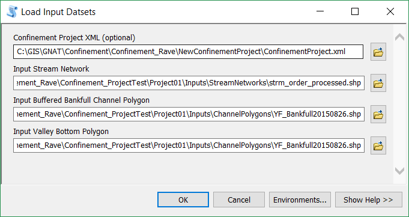

In order to generate confinement within a project, you must first load the three input files to the project.

## Stream Network
This is the basic line network that represents the stream. Confinement calculations and attributes will be applied to a final output based on this network. 

- The network should be in a projected coordinate system.
- The network can be of any GIS format, but once loaded to a Confinement project it will be stored as a shapefile. Please note that field names will be truncated to 10 char.
- The network will work best when it is contained completely within the Channel and Valley Bottom Polygons
- **Confinement values are based on the segmentation that exists in the stream network; you must do this prior to loading the network to the confinement project.** The Confinement by Segments tool will use a specified field to dissolve the network segments. 
- The confinement tool does not currently accept other [Riverscapes projects as inputs](https://github.com/SouthForkResearch/ConfinementTool/issues/10). Instead, use the output GIS layers from these projects directly.

## Active Channel Polygon (Bankfull Buffer)
This polygon represents the margins of the area considered to be the active channel, plus a buffer to account for digitization error and uncertainty. They may exist outside the boundary of the valley bottom (this is how a confined margin is determined).

- The dataset should be in a projected coordinate system.
- The dataset can be of any GIS polygon format, but once loaded to a Confinement project it will be stored as a shapefile. Please note that field names will be truncated to 10 char.
- The confinement tool does not currently accept other [Riverscapes projects as inputs](https://github.com/SouthForkResearch/ConfinementTool/issues/10).  Instead, use the output GIS layers from these projects directly.

## Valley Bottom Polygon 
This polygon represents the margins of the valley bottom that provides a confining margin to the stream. 

- The dataset should be in a projected coordinate system.
- The dataset can be of any GIS polygon format, but once loaded to a Confinement project it will be stored as a shapefile. Please note that field names will be truncated to 10 char.
- The confinement tool does not currently accept other [Riverscapes projects as inputs](https://github.com/SouthForkResearch/ConfinementTool/issues/10).  Instead, use the output GIS layers from these projects directly.

# Steps to Load the Input Datasets

2. In ArcMap navigate to Confinement Toolbox / Confinement Project Management /  Load Input Datasets in ArcToolbox.
  1. Specify the Project.xml file created in step 1.
  2. Specify the following three inputs to the project:
    * Stream Network
    * Channel/Bankfull Buffer Polygon
    * Valley Bottom Polygon 
    > These are listed as "optional" inputs, but you will need one of each type loaded in order to proceed with the confinement workflow.
  3. Click OK to import the inputs into the project.

3. The Project.xml file will be updated to include these inputs, and they will be stored appropriately in the Project folder structure:

   * **Inputs** (all inputs are stored in here)
     * **ChannelPolygons** (all Active Channel Polygons are added here)
       * **ChannelPolygon001** (Each Active Channel Polygon gets a sequentially numbered folder, as it is added to the project)
         * *Your_Channel_Polygon.shp*
     * **StreamNetworks** (all Stream Networks are added here)
       - **StreamNetwork001** (Each Stream Network gets a sequentially numbered folder, as it is added to the project)
         - *Your_Stream_Network.shp*
     * **ValleyBottoms** (all Valley Bottom Polygons are added here)
       - **ValleyBottom001** (Each Valley Bottom Polygon gets a sequentially numbered folder, as it is added to the project)
         - *Your_Valley_Bottom.shp*

   The following is an example of a project with two channel polygons, two stream networks, and one valley bottom added to it:

   

> **At this point in the project, do not move or rename any files within the project folder. Doing so could cause the project to become corrupt. **
>

This step may be repeated to load more than one version of an input dataset to the project. This is useful for generating multiple confinement realizations.

With Input datasets loaded to the project, the next step is to generate [Confining Margins](Generate-Confining-Margins)

